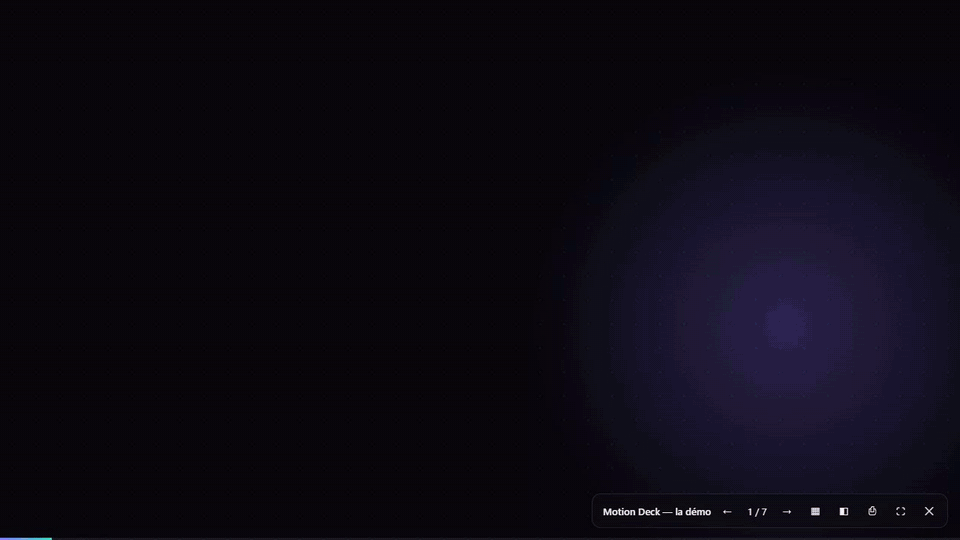
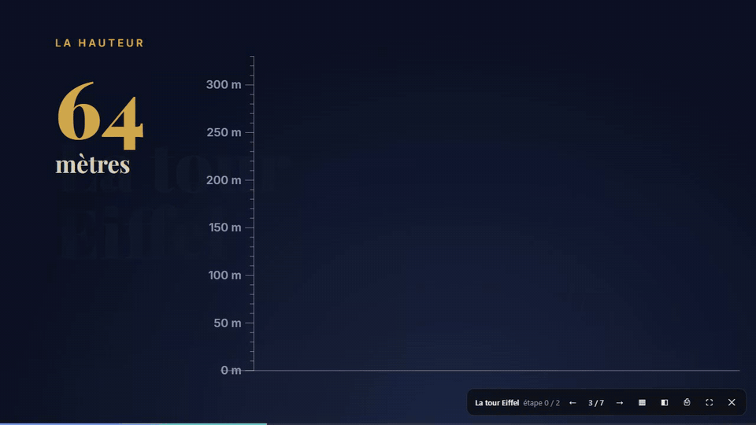
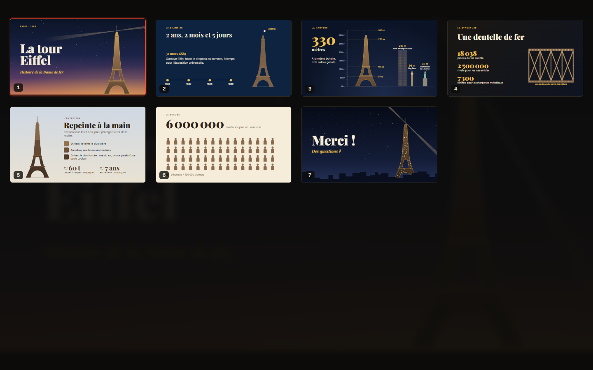
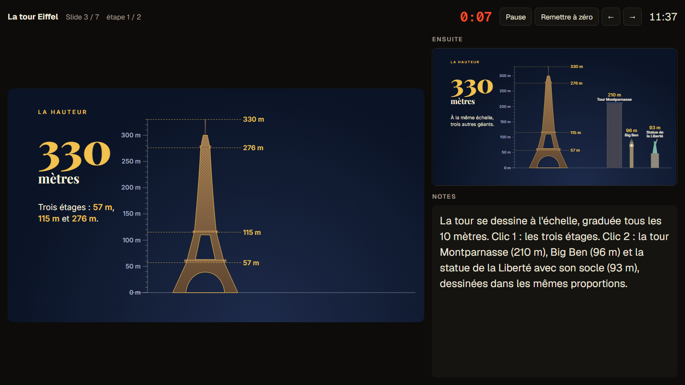

<div align="center">

# Motion Slides

**Slides as motion design. Written by Claude, played like PowerPoint.**

Ask Claude for a presentation, get a single `.deck.html` file,<br>
drop it into Motion Slides and press <kbd>Space</kbd>.

[](https://github.com/huguitow/motion-slides/actions/workflows/ci.yml)
[](LICENSE)


[**Try it in your browser →**](https://huguitow.github.io/motion-slides/)



</div>

## Why

PowerPoint slides are static. Claude, on the other hand, is remarkably good at hand-coding motion design in HTML, CSS, SVG and Canvas: kinetic type, charts that grow, illustrations that draw themselves.

Motion Slides is the missing piece: a **player** that turns those hand-coded pages into a real presentation tool. Full screen, click to advance, builds within a slide, overview, presenter view, PDF export. The slides themselves are just web pages, so anything a browser can render, your slides can do.

<div align="center">

<br><sub>From the bundled <em>Eiffel Tower</em> example: numbers are shown to scale, not just written.</sub>
</div>

## How it works

1. **Copy the prompt.** The home screen has a *Copier le prompt pour Claude* (copy the prompt) button. The prompt is the whole format specification plus art-direction rules.
2. **Ask any Claude.** Paste it into claude.ai, the desktop app or Claude Code, followed by your topic. Claude returns one self-contained `.deck.html` file.
3. **Drop it into Motion Slides** and present. No install, no account, no API key: everything runs locally in your browser.

The prompt pushes Claude towards real visual storytelling: an identity derived from the topic (palette, fonts, a recurring motif), an SVG illustration on every slide, and every figure shown **to scale** next to familiar references.

## Features

| | |
|---|---|
| **PowerPoint-style navigation** | <kbd>Space</kbd>, <kbd>→</kbd> or click to advance; <kbd>←</kbd> or right-click to go back. On-click *builds* inside a slide, and going back lands on the previous slide's last build, just like PowerPoint. |
| **Overview** | <kbd>O</kbd> opens a grid of live thumbnails; arrows + <kbd>Enter</kbd> to jump. Or type a slide number and press <kbd>Enter</kbd>. |
| **Presenter view** | <kbd>P</kbd> opens a second window with the current slide, the next build, your speaker notes, a timer and the clock. It remote-controls the audience window. |
| **PDF export** | <kbd>Ctrl</kbd>+<kbd>P</kbd> exports one 16:9 page per slide, each at its final build. |
| **Deck checker** | Generated decks are checked on load (unused builds, unknown transitions, clickable elements, external media…). The deck still plays; a ⚠ button lists the issues and copies a ready-to-paste fix request for Claude. |
| **Scales everywhere** | Slides are authored on a fixed 1920×1080 canvas and scaled to any screen, from a phone to a projector. |

<table>
  <tr>
    <td width="50%"></td>
    <td width="50%"></td>
  </tr>
  <tr>
    <td align="center"><sub>Overview (<kbd>O</kbd>)</sub></td>
    <td align="center"><sub>Presenter view (<kbd>P</kbd>)</sub></td>
  </tr>
</table>

## The `.deck.html` format

One file, one `<template>` per slide. Everything else is plain HTML, CSS and JavaScript.

```html
<meta name="deck-title" content="My talk">

<!-- Injected into every slide: fonts, shared colours, helpers -->
<template data-deck-head>
  <style>:root { --accent: #8b7bff; }</style>
</template>

<!-- A slide with 2 on-click builds and a slide-in transition -->
<template data-slide data-steps="2" data-transition="slide">
  <style>
    .point { opacity: 0; transition: opacity .6s; }
    html[data-step="1"] .p1, html[data-step="2"] .point { opacity: 1; }
  </style>
  <h1>Hello</h1>
  <p class="point p1">First build</p>
  <p class="point p2">Second build</p>
  <script>
    deck.onStep((step, direction) => { /* or drive builds from JavaScript */ });
  </script>
  <aside data-notes>Speaker notes, shown in the presenter view.</aside>
</template>
```

| Hook | What it gives you |
|---|---|
| `data-steps="N"` | Number of on-click builds before moving on |
| `data-transition` | `fade` (default), `slide` or `none` |
| `html[data-step="N"]` | Current build, for CSS-only animations |
| `.deck-entered` on `<html>` | Added when the slide becomes visible: start entrance animations |
| `deck.onStep`, `deck.onEnter`, `deck.onLeave` | JavaScript hooks, with `deck.step`, `deck.steps`, `deck.slideIndex`, `deck.slideCount` |

The full specification is the prompt itself: [`prompt/PROMPT_CLAUDE.md`](prompt/PROMPT_CLAUDE.md). Two complete examples live in [`public/examples/`](public/examples/): the [demo](public/examples/demo.deck.html) and the [Eiffel Tower](public/examples/tour-eiffel.deck.html) talk.

## Security model

A `.deck.html` file is arbitrary JavaScript, so Motion Slides treats every slide as untrusted:

- each slide runs in its own `<iframe sandbox="allow-scripts">` **without** `allow-same-origin`: it cannot read the player page, its storage or its cookies;
- a transparent shield sits above the slides, so keyboard focus and clicks always stay with the player;
- the player and slides talk only through a tiny, validated `postMessage` protocol; the presenter window uses a validated `BroadcastChannel` protocol limited to navigation.

## Development

```bash
npm install
npm run dev        # http://localhost:5173
npm test           # unit tests (Vitest + jsdom)
npm run coverage   # coverage of the pure logic
npm run build      # type-check + production build in dist/
```

Built with TypeScript and Vite, no runtime dependencies. The pure logic (parsing, navigation, validation, the slide runtime, the presenter protocol) lives in [`src/deck/`](src/deck/) and is unit-tested; the UI lives in [`src/player/`](src/player/) and [`src/presenter/`](src/presenter/). Pushing to `main` deploys the app to GitHub Pages.

> **Language note:** the interface, the prompt and the example decks are in French for now. Claude answers in the language you write your topic in, and translations of the UI and prompt are very welcome.

## Roadmap ideas

- Video export (MP4/WebM) of a deck
- English and multilingual UI and prompt
- More example decks, and a gallery of community decks
- Optional "Generate" button for people who bring their own API key

## Contributing

Issues and pull requests are welcome: see [CONTRIBUTING.md](CONTRIBUTING.md). Example decks and prompt improvements are especially valuable.

## License

[MIT](LICENSE) © Hugo Desjardins
